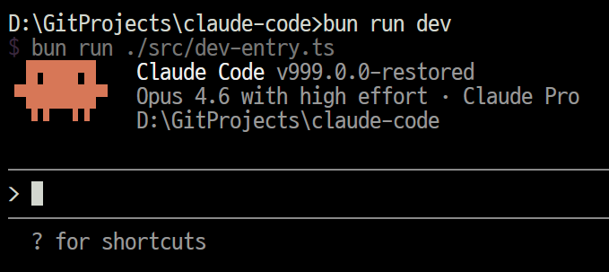

# Claude Code Source Code Reconstruction

[](https://bun.sh)
[](.)

Complete TypeScript source code of the Claude Code CLI, reconstructed from source maps and **runnable locally**.



> [!WARNING]
> This repository is an **unofficial** version, reconstructed from the source map of the public npm release package. It is **for research and learning purposes only** and does not represent the internal development repository structure of Anthropic. Some modules have been replaced with compatible shims.

---

## Requirements

- Bun ≥ 1.3.5
- Node.js ≥ 24

## Quickstart

```bash
$ bun install       # Install dependencies
$ bun run dev       # Start CLI (Interactive)
$ bun run version   # Verify version number
```

---

## Project Structure

```text
.
├── src/                # Core source code (~2,006 TS/TSX files)
│   ├── entrypoints/    # CLI entry points
│   ├── main.tsx        # Main initialization (auth / MCP / settings / feature flags)
│   ├── dev-entry.ts    # Development entry point
│   ├── QueryEngine.ts  # Core engine (~1,295 lines, LLM API loop, persistence)
│   │
│   ├── tools/          # Tool implementations (53 items: Bash, Read, Edit, Agent...)
│   ├── commands/       # Slash commands (87 items)
│   ├── services/       # Backend services (API, MCP, OAuth, telemetry/Datadog)
│   ├── utils/          # Utility functions (git, permissions, model, token budget)
│   │
│   ├── components/     # Terminal UI components (~406 files, React + Ink)
│   ├── hooks/          # Custom React Hooks
│   ├── ink/            # Ink terminal renderer (custom branch)
│   ├── vim/            # Vim mode engine
│   ├── keybindings/    # Keybindings
│   │
│   ├── coordinator/    # Multi-Agent orchestration and worker coordination
│   ├── bridge/         # IDE bidirectional communication & remote bridge control
│   ├── remote/         # Remote session teleportation & management
│   ├── server/         # IDE direct connection server
│   ├── skills/         # Reusable workflow & skill system
│   ├── plugins/        # Plugin system
│   ├── memdir/         # Persistent memory system (5-tier memory)
│   ├── voice/          # Voice interaction (streaming STT, unreleased)
│   ├── buddy/          # Gacha companion sprite system (Easter egg)
│   └── assistant/      # "KAIROS" always-running daemon mode (unreleased)
│
├── shims/              # Native module compatibility alternatives
├── vendor/             # Native binding source code
├── package.json
├── tsconfig.json
└── bun.lock
```

---

## Architecture

Claude Code is built on top of a highly optimized and robust architecture designed for LLM API interaction, token efficiency, and advanced execution boundaries.

### Boot Sequence

```text
dev-entry.ts → entrypoints/cli.tsx → main.tsx → REPL (React/Ink)
  │                │          │
  │                │          └─ Full Initialization: Auth → GrowthBook (Feature Flags) → MCP → Settings → Commander.js
  │                └─ Fast Path: --version / daemon / ps / logs
  └─ Startup Gate: scans for missing relative imports; blocks boot until all resolve
```

### Core Engine & Token Optimization

Token efficiency is critical for survival in Claude Code. The architecture employs industry-leading token saving techniques:
- **`QueryEngine.ts`**: The central engine (~1,295 lines) managing the LLM API loop, session lifecycle, and automatic tool execution.
- **3-Tier Compaction System**:
  1. **Microcompact**: Uses the `cache_edits` API to remove messages from the server cache without invalidating the prompt cache context (zero API cost).
  2. **Session Memory**: Uses pre-extracted session memory as a summary to avoid LLM calls during mid-level compaction.
  3. **Full Compact**: Instructs a sub-agent to summarize the conversation into a structured 9-section format, employing `<analysis>` tag stripping to reduce token usage while maintaining quality.
- **Advanced Optimizations**: 
  - `FILE_UNCHANGED_STUB`: Returns a brief 30-word stub for re-read files.
  - Dynamic max output caps (8K default with 64K retry) preventing slot-reservation waste.
  - Caching latches to prevent UI toggles limits (e.g., Shift+Tab) from busting 70K context.
  - Circuit breakers preventing wasted API calls on consecutive compaction failures.

### Harness Engineering (Permissions & Security)

The "Harness" safely controls LLM operations within the local environment:
- **Permission Modes**: Features 6 primary modes (`acceptEdits`, `bypassPermissions`, `default`, `dontAsk`, `plan`) plus internal designations like `auto` (yoloClassifier) and `bubble` (sub-agent propagation).
- **Security Checkers**: Incorporates PowerShell-specific security analysis to detect command injection, download cradles, and privilege escalation, as well as redundant path validations.
- **Architectural Bypasses**: Specific environments intentionally bypass checks (e.g., `CLAUDE_CODE_SIMPLE` clears system prompts), while failing schema parsing can inadvertently circumvent standard permissions.

### Teams & Multi-Agent Orchestration

- **Agents**: Orchestrated via `AgentTool`, created with three distinct paths: Teammate (tmux or in-process), Fork (inheriting context), and Normal (fresh context).
- **Coordinator Mode**: A designated coordinator delegates exact coding tasks to worker agents (`Agent`, `SendMessage`, `TaskStop`), effectively isolating high-level reasoning from raw file execution.

### Memory System (5-Tier Architecture)

Designed to persist AI knowledge across sessions and agents:
1. **Memdir**: Project-level indices and topic files (`MEMORY.md`).
2. **Auto Extract**: Fire-and-forget forked agent that consolidates memory post-session.
3. **Session Memory**: Real-time context tracking without extra LLM overhead.
4. **Team Memory**: Shared remote state leveraging SHA-256 delta uploads and git-leaks-based secret extraction guards.
5. **Agent Memory**: Agent-specific knowledge scoped to local, project, or user levels.

### Unreleased Subsystems & Future Directions

Hidden behind 88+ compile-time feature flags and 700+ GrowthBook runtime gates:
- **KAIROS**: An always-running background daemon featuring a "Dream" mode (autonomous memory consolidation during idle time).
- **Computer Use ("Chicago")**: macOS desktop control MCP (mouse, keyboard, screenshot capabilities).
- **Voice Mode**: Microphone control utilizing streaming STT.
- **ULTRAPLAN**: Capable of executing multi-agent planning over 30-minute CCR sessions.
- **Web Browser ("Bagel") & Teleport**: Integrated web navigation and remote session context teleportation.

### UI Architecture

Terminal UI based on **React + Ink**:

- `ink/` — Custom Ink branch (layout / focus / ANSI / virtual scrolling / click detection)
- `components/` (~406 files) — Messages, inputs, diffs, permission dialogs, status bar
- `hooks/` — Tools / voice / IDE / vim / sessions / tasks
- `vim/` — Full Vim keybinding engine (motions, operators, text objects)

---

## Reconstruction Notes

Source maps cannot 100% reconstruct the original repository. The following may be missing or degraded:

| Type | Description |
|------|-------------|
| **Type-only files** | Type-only `.d.ts` files may be missing |
| **Build artifacts** | Code generated during the build is not in the source map |
| **Native bindings** | Private native modules are replaced with `shims/` |
| **Dynamic resources** | Dynamic imports and resource files may be incomplete |

---

## Patches

This fork includes the following modifications from the original source:

| Patch | Description | Related Issue |
|-------|-------------|---------------|
| **Welcome banner toggle** | Added `showWelcomeBanner` setting to disable the startup banner (LogoV2). Set `"showWelcomeBanner": false` in `~/.claude/settings.json` to hide. | [#2254](https://github.com/anthropics/claude-code/issues/2254) |

---

## Disclaimer

- The source code copyright belongs to [Anthropic](https://www.anthropic.com).
- This is for technical research and learning purposes only. Please do not use it for commercial purposes.
